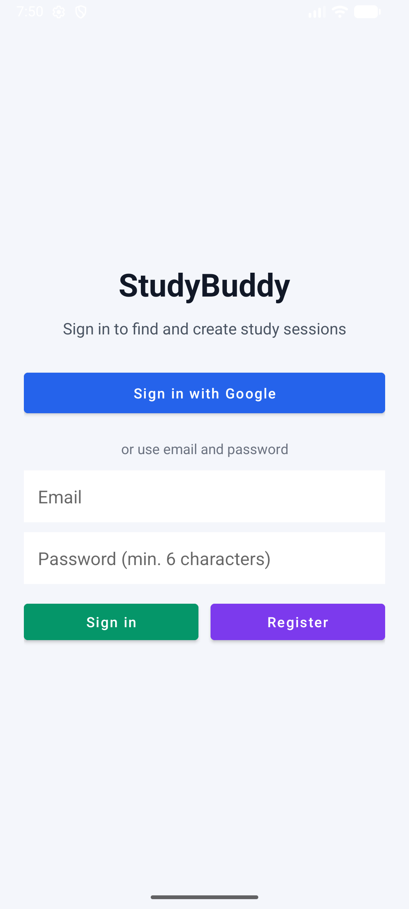
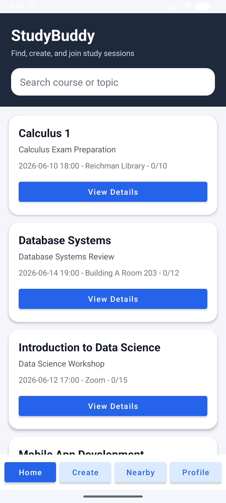
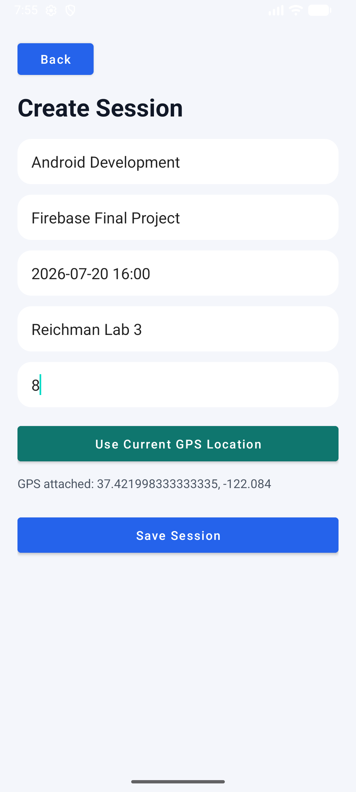
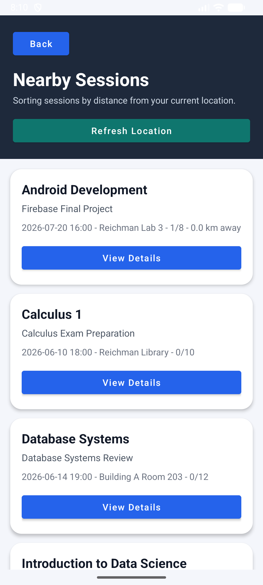
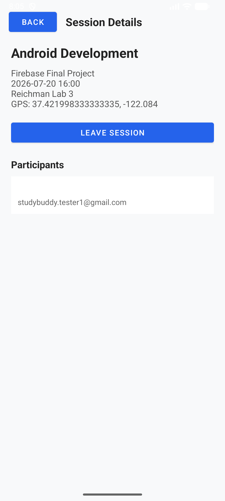
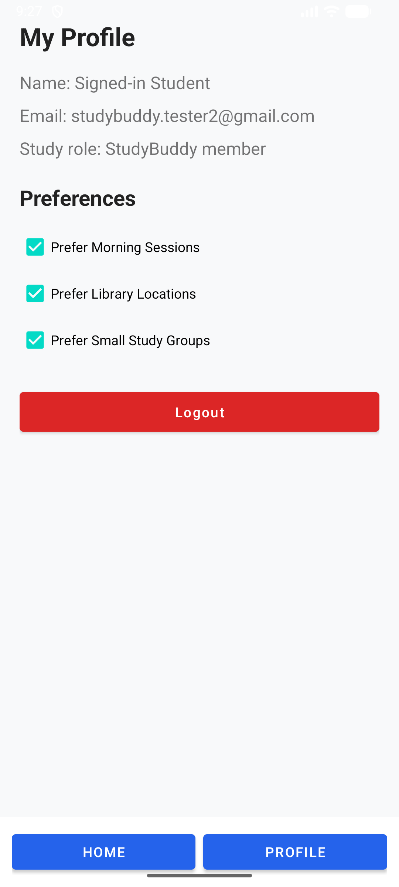

# StudyBuddy — Final Project Reflection Document

**Course:** Advanced Topics in App Innovation, Reichman University
**Team:** Itay Simchai *(add teammate names here)*
**GitHub Repository:** https://github.com/itaysimchai/StudyBuddy

---

## 1. About the App

StudyBuddy helps students find, create, and join study sessions around them.
Every piece of data lives in **Cloud Firestore** — sessions, participants, and
per-user preferences — and the app uses the phone's **GPS** both to attach real
coordinates when creating a session and to sort sessions by distance from the
user's current location.

## 2. Features Implemented

| Area | What we built |
|---|---|
| **Authentication** | Google Sign-In **and** email/password sign-in + registration (bonus second method) |
| **Firestore** | `Sessions` collection (sessions + participants array) and `Users` collection (per-user preferences) — no static data anywhere |
| **Phone capability (GPS)** | "Use Current GPS Location" when creating a session; Nearby page sorts all sessions by distance (`Location.distanceBetween`) |
| **Sessions** | Create, browse, live text search by course/topic, join/leave with capacity limit |
| **Concurrency safety** | Join/leave runs inside a **Firestore transaction**, so two users acting at once can never overwrite each other's changes |
| **Analytics** | Events: `login`, `sign_up`, `sessions_loaded`, `session_created`, `session_opened`, `session_participation_changed` |
| **Crashlytics** | Connected via the Crashlytics Gradle plugin; verified with a test crash visible in the dashboard |
| **Security** | Firestore rules require authentication for all reads/writes; each user can only access their **own** `Users/{uid}` document |

**Tools used:** Android Studio, Java, AndroidX (RecyclerView, ConstraintLayout),
Firebase (Authentication, Firestore, Analytics, Crashlytics), Google Play
services (Google Sign-In, location), Gradle, Git & GitHub, Android Emulator.

## 3. User Flow (with screenshots)

**Step 1 — Login.** The app opens on the login page, which offers two ways in:
Google Sign-In (required method) or email/password (bonus method) with both
sign-in and registration. A successful login logs an Analytics event and
continues to the home page.

**Step 2 — Home.** All study sessions are loaded live from the Firestore
`Sessions` collection. The search box filters by course name or topic as you
type, and the bottom navigation leads to every other page.

**Step 3 — Create Session.** The user fills in the course, topic, time,
location name and capacity, then taps **Use Current GPS Location**. The app
requests the location permission at runtime and attaches the phone's real
coordinates to the session before saving it to Firestore.

**Step 4 — Nearby Sessions.** The app reads the phone's current GPS position
and sorts all sessions by distance. In the screenshot, the session created at
the current location shows "0.0 km away" and is ranked first.

**Step 5 — Session Details & Join.** Opening a session shows its full details,
GPS coordinates, and participants. Joining adds the signed-in user to the
participants array inside a Firestore transaction (and respects the
max-participants limit); the button flips to "Leave Session".

**Step 6 — Profile.** Shows the authenticated user's details and study
preferences. The preference checkboxes are loaded from and saved to the user's
own document in the `Users` collection, so they survive app restarts and
follow the user across devices. Logout signs out of both Firebase and Google.

## 4. Challenges Faced and How We Overcame Them

**Expired Firestore test-mode rules.** Mid-project, every Firestore call
suddenly failed with `PERMISSION_DENIED`. The database had been created in
"test mode", whose rules expire after 30 days. We replaced them with real
production rules: all access requires authentication, and `Users/{uid}`
documents are readable/writable only by their owner. This turned a blocking
bug into a better security design.

**Google Sign-In configuration.** Sign-in failed because our
`google-services.json` had an empty `oauth_client` list — the Google provider
was never fully configured. We enabled the Google provider in the Firebase
console, registered the app's SHA-1 debug fingerprint, and regenerated
`google-services.json`. We also made the login code look up the OAuth web
client id dynamically so the app still builds and shows a clear message if the
configuration is missing.

**Race condition when joining/leaving sessions.** The original implementation
wrote the whole participants array from a local copy, so two users joining at
the same time could erase each other. We rewrote it as a **Firestore
transaction** that re-reads the document, modifies the fresh participants
list, and writes it back atomically — including a de-duplication pass and a
capacity check against the fresh data.

**Static data left over from the first project phase.** The profile
preferences were originally hard-coded checkboxes (and the early prototype
used a `FakeData` class). We migrated everything to Firestore: preferences now
live in a per-user `Users` document, created on first visit and updated on
every change.

**Emulator quirks.** We hit several confusing emulator issues: an install
failure (`Can't find service: package`) caused by installing before the
emulator finished booting, a black-screen rendering glitch after an ANR, and
"no last known location" on freshly booted emulators. Cold-booting the AVD and
setting a location in Extended Controls solved them — and taught us to always
verify the environment before blaming the code.

## 5. What We Learned

Beyond the specific APIs, the project taught us to treat Firebase as a system:
authentication, database rules, analytics and crash reporting all interact.
The most valuable lessons were debugging configuration problems from error
messages (OAuth, security rules) and thinking about concurrent users from the
start rather than as an afterthought.
